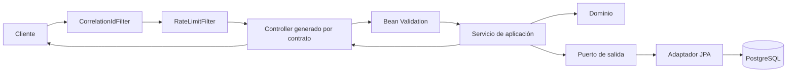

# Tizo Ecommerce API

API REST contract-first para el ecommerce Angular de Tizo. Implementa catálogo, carrito, checkout idempotente,
pedidos del cliente, cancelaciones, operación interna, resolución concurrente, auditoría y efectos durables sobre
Java 21, Spring Boot 4.1 y PostgreSQL.

> Estado de seguridad: el perfil local usa identidades demo. El perfil `production` las desactiva por defecto; el
> workflow puede habilitar temporalmente una identidad demo restringida sin registrar reset ni fault injection.
> Esta modalidad no reemplaza autenticación/autorización real y no se debe publicar a Internet como solución final.

## Decisiones técnicas

- Monolito modular con límites verificados por Spring Modulith y dependencias hexagonales explícitas.
- OpenAPI 3.1 es la fuente de verdad; Maven genera interfaces HTTP y DTO. Scalar renderiza la referencia.
- DTO HTTP, dominio y modelos de persistencia no se comparten por conveniencia.
- Jakarta Bean Validation valida el contrato; los casos de uso y agregados protegen reglas contextuales e invariantes.
- Errores públicos en `application/problem+json`, RFC 9457, con código estable y correlation ID.
- Excepciones tipadas para fallos que abortan el caso de uso; no existe un envelope universal ni un `Result<T>` global.
- Spring Data/JPA permanece en adaptadores de salida. `EntityManager` y `@Transactional` ya cubren Unit of Work.
- Idempotencia, optimistic/pessimistic locking, constraints y reconciliación cubren reintentos y resultados inciertos.
- Los efectos críticos usan una tabla durable PostgreSQL con lease/retry/backoff; `@Async` queda para trabajo no crítico.
- Imagen Docker multi-stage, non-root y read-only; entrega AWS por digest mediante GitHub OIDC, ECR y SSM.

## Flujo de una petición



Los módulos principales son `catalog`, `sales`, `operations`, `demo` y `shared`. La identidad demo se habilita con
`TIZO_DEMO_ENABLED`; el reset y fault injection requieren además `TIZO_DEMO_TOOLS_ENABLED=true` y nunca se registran
con el perfil `production`.

## Requisitos

- JDK 21.
- Docker Desktop o Docker Engine con Compose.

## Inicio local

```powershell
docker compose up -d postgres
docker compose exec postgres createdb -U tizo tizo_test
$env:SPRING_PROFILES_ACTIVE = 'local'
.\mvnw.cmd spring-boot:run
```

`createdb` sólo es necesario una vez; si informa que `tizo_test` ya existe, continúe. Las credenciales
`tizo/tizo-local-only` son exclusivamente locales.

Docker Compose también puede conectar la API local a una base externa mediante un archivo `.env`, que está excluido
de Git. Debe definir `TIZO_DB_URL`, `TIZO_DB_USERNAME` y `TIZO_DB_PASSWORD`. Para evitar cargar datos demo en una base
remota, configure además `SPRING_FLYWAY_LOCATIONS=classpath:db/migration`. Compose conserva los valores locales
anteriores como fallback cuando el archivo no existe.

```powershell
docker compose --profile app up -d --build api
docker compose logs --tail 100 api
```

Flyway aplica las migraciones al iniciar la aplicación. La base externa debe ser alcanzable desde el equipo, por
ejemplo mediante VPN o un túnel de AWS Systems Manager; no se debe publicar PostgreSQL para habilitar desarrollo local.

Servicios disponibles:

| Recurso | URL |
|---|---|
| API | `http://localhost:8080/api` |
| Referencia Scalar | `http://localhost:8080/docs` |
| Contrato OpenAPI | `http://localhost:8080/openapi/openapi.yaml` |
| Readiness | `http://localhost:8081/actuator/health/readiness` |
| Liveness | `http://localhost:8081/actuator/health/liveness` |
| Prometheus | `http://localhost:8081/actuator/prometheus` |

Todas las respuestas incluyen `X-Correlation-ID`. Las mutaciones reintentables reciben `idempotencyKey` según el
contrato; las operaciones demo reciben `X-Operator-Id` cuando corresponde.

Los recorridos funcionales, la reconciliación, las carreras y los ocho escenarios demo se verifican mediante las
pruebas de integración y end-to-end incluidas en `src/test`.

## Perfiles

| Perfil | Identidad demo | Herramientas demo | Flyway | Logging | Uso |
|---|---:|---:|---|---|---|
| `local` | Sí | Sí | `db/migration` + `db/local` | Consola legible/DEBUG de aplicación | Desarrollo manual |
| `test` | Sí | Sí | `db/migration` + `db/local` | Consola | Integración aislada |
| `production` | Configurable | No | Sólo `db/migration` | JSON Logstash/stdout | Contenedor AWS |

Producción exige `TIZO_DB_URL`, `TIZO_DB_USERNAME` y `TIZO_DB_PASSWORD`. Actuator escucha sólo en loopback; `/readyz`
y `/livez` se añaden al puerto de aplicación para healthchecks del ALB sin publicar Prometheus.

### Identidad demo restringida en el despliegue

El workflow de producción construye la imagen con `TIZO_DEMO_ENABLED` y `TIZO_DEMO_CUSTOMER_ID`, tomados de las
variables del environment `production` de GitHub. Mientras esas variables no existan, el despliegue usa
`TIZO_DEMO_ENABLED=true` y `TIZO_DEMO_CUSTOMER_ID=customer-001`. Para desactivar posteriormente la identidad demo,
configure `TIZO_DEMO_ENABLED=false` en ese environment y vuelva a ejecutar el workflow.

La imagen fija `TIZO_DEMO_TOOLS_ENABLED=false` y los componentes destructivos también están excluidos mediante el
perfil `production`. Así, la identidad implícita permite temporalmente los casos de uso `/api/me/*`, pero
`POST /api/mock/reset` y los escenarios de fault injection permanecen ausentes. La aplicación continúa usando la
base indicada por `TIZO_DB_URL`; el cliente configurado debe existir allí. Esta modalidad no sustituye autenticación
real y no debe considerarse aislamiento entre usuarios.

## Verificación

Suite reproducible con PostgreSQL Testcontainers:

```powershell
.\mvnw.cmd clean verify
```

Suite contra la base local `tizo_test`:

```powershell
.\mvnw.cmd '-Dtizo.test.local=true' clean verify
```

Gobernanza del contrato:

```powershell
npx --yes '@redocly/cli@2.46.0' lint src/main/openapi/openapi.yaml
npx --yes '@redocly/cli@2.46.0' bundle src/main/openapi/openapi.yaml `
  --output target/openapi/openapi.yaml
```

El pipeline también ejecuta `oasdiff` contra la rama base, smoke del contenedor y escaneo de vulnerabilidades.

## Docker

Construir y ejecutar API + PostgreSQL:

```powershell
docker build -t tizo-api:local .
docker compose --profile app up -d --build
docker compose ps
```

El workflow de CI ejecuta el smoke de la imagen con PostgreSQL efímero, filesystem de solo lectura y usuario no root.
Para detener el entorno local sin borrar sus datos:

```powershell
docker compose --profile app down
```

## Contrato HTTP

El contrato fuente es [src/main/openapi/openapi.yaml](src/main/openapi/openapi.yaml). Contiene 22 `operationId` y
conserva las rutas `/api/...` requeridas por el frontend existente. La excepción frente a la convención futura
`/api/v1` es deliberada para mantener compatibilidad con el frontend actual.

OpenAPI es el estándar; Swagger es una familia de herramientas. Scalar es únicamente el renderer interactivo y nunca
la fuente de verdad. Un cambio público debe actualizar primero el YAML, pasar Redocly, regenerar interfaces, ejecutar
pruebas contractuales y superar `oasdiff`.

## Persistencia y concurrencia

- Flyway crea/valida el esquema; producción usa `ddl-auto=validate`, nunca `update`.
- Repositorios y queries se implementan por agregado/proyección, con mapeo explícito.
- Checkout bloquea carrito y productos; las decisiones bloquean solicitud, pedido y líneas.
- `@Version`, constraints parciales e idempotencia garantizan un único resultado durable.
- Un replay con la misma intención devuelve el snapshot almacenado; la misma clave con otro payload devuelve `409`.
- Tras perder una respuesta, el cliente consulta el endpoint de reconciliación con la clave original.
- Auditoría es append-only y separada del log técnico. Los efectos operacionales se procesan con
  `FOR UPDATE SKIP LOCKED`, lease y reintentos acotados.

## Observabilidad y datos sensibles

Producción escribe JSON estructurado a stdout. MDC aporta `correlationId`; Micrometer expone métricas técnicas y de
negocio. No registrar passwords, cookies, tokens, connection strings, payloads completos, SQL ni mensajes internos de
PostgreSQL. `X-Correlation-ID` y `traceparent` son identificadores distintos y deben propagarse por separado.

Además de `http.server.requests`, HikariCP y JVM, Prometheus publica contadores de idempotencia/concurrencia,
`tizo_rate_limit_requests_total`, `tizo_operational_effects_total`,
`tizo_operational_effects_duration_seconds` y `tizo_operational_effects_queue_depth`. Las etiquetas son conjuntos
cerrados (`scope`, `result`, `type`, `status`); nunca incluyen IDs de pedidos, clientes o correlation IDs.

La línea base de aceptación distribuye 200 lecturas entre catálogo, carrito, pedidos y solicitudes con 50 consumidores.
Cada ruta debe conservar p95 menor a 1 s, p99 menor a 2 s y cero respuestas fallidas. Esta prueba de capacidad se
ejecuta con rate limiting desactivado; los despliegues normales conservan `TIZO_RATE_LIMIT_ENABLED=true`.

## CI/CD y AWS

- [`.github/workflows/ci.yml`](.github/workflows/ci.yml): contrato, build, pruebas PostgreSQL, arquitectura, Docker,
  smoke, seguridad y compatibilidad.
- [`.github/workflows/deploy-aws.yml`](.github/workflows/deploy-aws.yml): OIDC, ECR, digest, SBOM/provenance, SSM,
  escaneo de seguridad y entrega mediante un comando administrado del host.

La entrega incluida es el pipeline; no crea recursos ni ejecuta un despliegue real en una cuenta AWS. El repositorio
debe configurar `AWS_REGION`, `ECR_REPOSITORY`, `AWS_GITHUB_ROLE_ARN` y `AWS_EC2_INSTANCE_ID`, además de proteger el
environment `production`. La instancia privada debe estar administrada por Systems Manager y proporcionar
`/opt/tizo/bin/deploy-container.sh`, responsable de usar el digest recibido, comprobar readiness y hacer rollback.

## Convención de commits

El repositorio usa Conventional Commits con alcance cuando aporta contexto:

```text
feat(catalog): add product search
fix(checkout): prevent duplicate stock decrement
test(operations): cover competing decisions
docs(aws): explain rollback by digest
chore(ci): pin OpenAPI tooling
```

Cada commit debe representar una capacidad coherente, dejar la suite relevante verde y no mezclar reformateos o
cambios ajenos.
